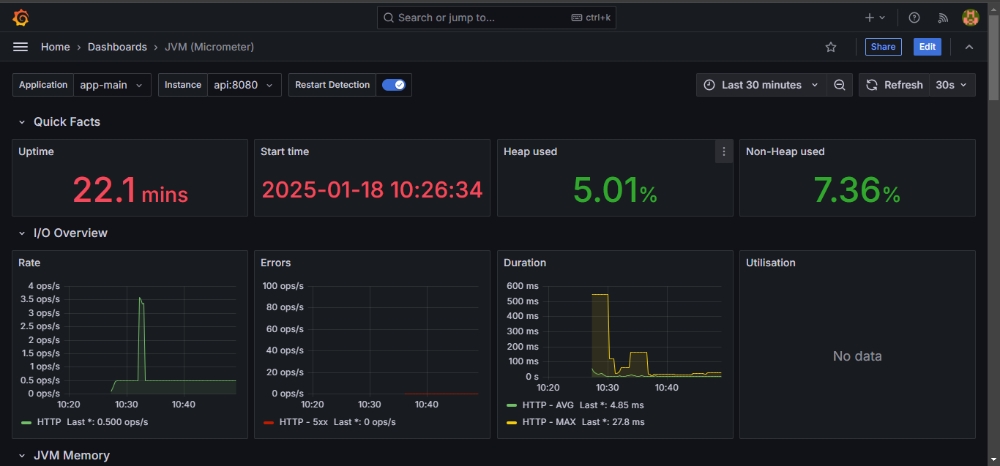
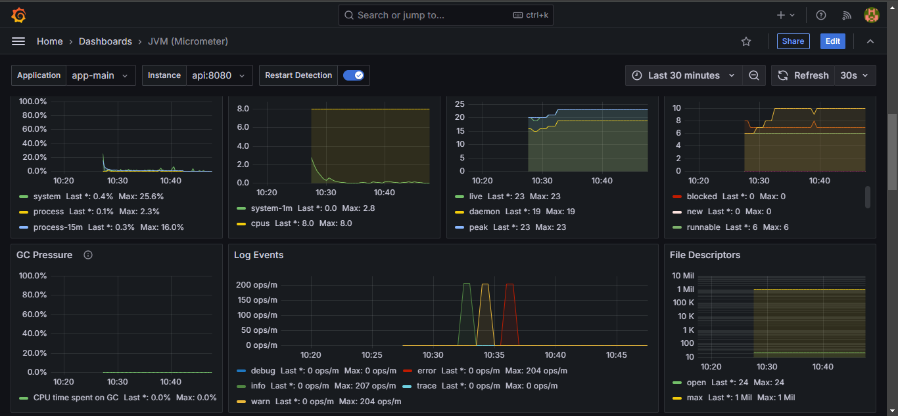
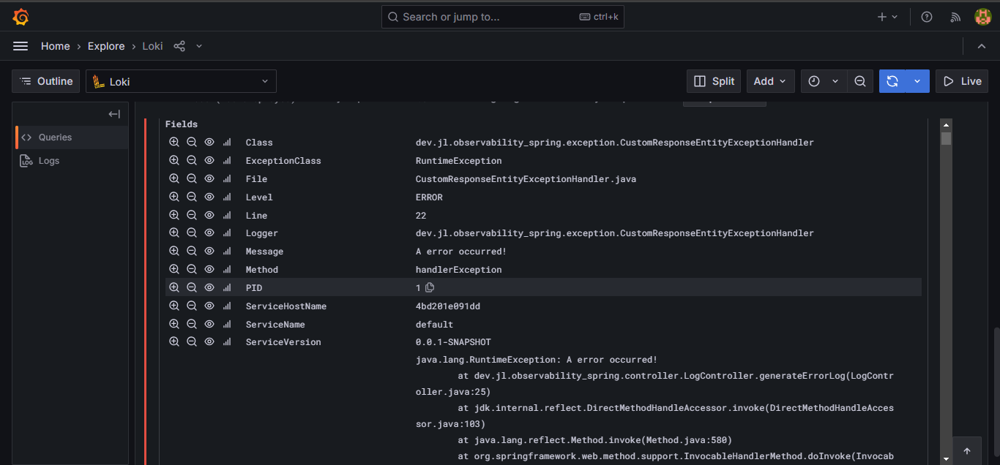
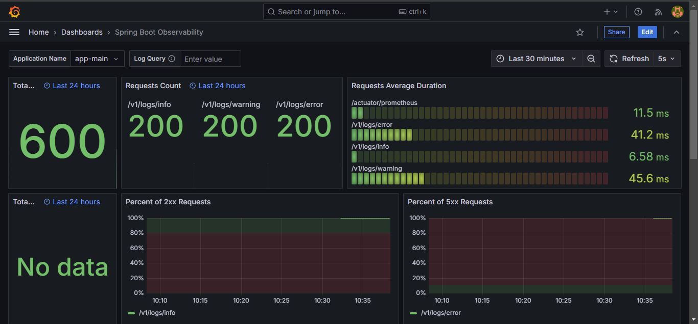

# API Monitoring with Grafana, Loki, Promtail, and Prometheus


 

## Table of Contents

- [About](#about)
- [Getting Started](#getting-started)
  - [Prerequisites](#prerequisites)
  - [Installation](#installation)
- [How It Works](#how-it-works)
  - [Dependencies](#dependencies)
  - [Configurations](#configurations)
- [Usage](#usage)

---

## About

This project demonstrates how to monitor monolithic APIs using **Grafana**, **Loki**, **Promtail**, and **Prometheus**. It leverages **Spring Boot Actuator** for exposing application metrics, **Micrometer** for Prometheus integration, and **structured logging** with Logback.

### Dashboard Previews

|  |  |
|:---------------------------------------------:|:---------------------------------------------:|
|               |  |

**Dashboards Used**:  
- [JVM Micrometer](https://grafana.com/grafana/dashboards/4701-jvm-micrometer/)  
- [Spring Boot Observability](https://grafana.com/grafana/dashboards/17175-spring-boot-observability/)  

To use these dashboards, import them into Grafana and assign the required data sources (Prometheus/Loki).

---

## Getting Started

### Prerequisites

Ensure the following software is installed:

- **Docker Desktop**  
- **JDK 21**

### Installation

1. Generate the Spring Boot API `.jar` file:
   ```bash
   ./mvnw clean package
   ```

2. Start all services using Docker Compose:
   ```bash
   docker compose up -d
   ```

---

## How It Works

The Spring Boot API exposes metrics via Actuator, providing data on application performance, JVM usage, and system health.
Prometheus collects these metrics and Grafana visualizes them. The logs are sent to Loki via Promtail for analysis.

### Dependencies

- **Spring Boot Actuator** for metrics and health checks:
  ```xml
  <dependency>
      <groupId>org.springframework.boot</groupId>
      <artifactId>spring-boot-starter-actuator</artifactId>
  </dependency>
  ```

- **Micrometer Prometheus Registry** to generate data that can be consumed by prometheus:
  ```xml
  <dependency>
      <groupId>io.micrometer</groupId>
      <artifactId>micrometer-registry-prometheus</artifactId>
      <scope>runtime</scope>
  </dependency>
  ```

- **Logback Encoder** for structured JSON logging:
  ```xml
  <dependency>
      <groupId>net.logstash.logback</groupId>
      <artifactId>logstash-logback-encoder</artifactId>
      <version>8.0</version>
  </dependency>
  ```

### Configurations

1. **Application Properties**:  
   Configuration of endpoints exposed by the actuator:
   ```properties
   management.endpoint.health.show-details=always
   management.endpoints.web.exposure.include=health,prometheus
   management.metrics.tags.application=app-main
   management.metrics.distribution.percentiles-histogram.http.server.requests=true
   ```
   > The `management.metrics.tags.application=app-main` property integrates application metrics with the Spring Boot Observability dashboard, enabling selection by application name.

2. **Prometheus Configuration**:  
   `prometheus.yml` (via Docker bind mount):
   ```yaml
   global:
     scrape_interval: 2s
   scrape_configs:
     - job_name: "prometheus"
       static_configs:
         - targets: ["prometheus:9090"]
     - job_name: "api"
       metrics_path: "/api/actuator/prometheus"
       static_configs:
         - targets: ["api:8080"]
   ```

3. **Promtail Configuration**:  
   `promtail-config.yaml` (via Docker bind mount):
   ```yaml
   server:
     http_listen_port: 9080
     grpc_listen_port: 0

   positions:
     filename: /positions/positions.yaml

   clients:
     - url: http://loki:3100/loki/api/v1/push

   scrape_configs:
     - job_name: system
       static_configs:
         - targets: 
             - localhost
           labels:
             job: scraper_api
             __path__: /logs/api/*log
         - targets: 
             - localhost
           labels:
             job: varlogs
             __path__: /logs/syslogs/*log
   ```

4. **Shared Volume in Docker Compose**:  
   Share logs between the API and Promtail:
   ```yaml
   volumes:
     app-logs:
   services:
     api:
       build:
         context: .
         dockerfile: Dockerfile
       volumes:
         - app-logs:/logs/api/
     promtail:
       volumes:
         - app-logs:/logs/api/
   ```

---

## Usage

After starting the services, access them via these URLs:

- **API**: [http://localhost:8080](http://localhost:8080)  
- **Prometheus**: [http://localhost:9090](http://localhost:9090)  
- **Promtail**: [http://localhost:9080](http://localhost:9080)  
- **Grafana**: [http://localhost:3000](http://localhost:3000)  
- **Loki**: [http://localhost:3100](http://localhost:3100)  

### API Log Endpoints

Test logging by triggering these endpoints:

- `GET /api/v1/logs/info` - Generates an **info** log  
- `GET /api/v1/logs/error` - Generates an **error** log  
- `GET /api/v1/logs/warning` - Generates a **warning** log  

Logs are sent to Loki and visualized in Grafana.

### Performance Testing with `hey`

You can use the `hey` tool to simulate multiple requests and observe how the system handles them.

For example:

```bash
hey -n 100 http://localhost:8080/api/v1/logs/info
```
This command will send 100 requests to the info log endpoint, generating 100 log entries in Loki.

#### Observations

- Logs in Grafana

Visit Loki on Grafana to see how these logs are ingested and visualized in your dashboard.

- API Metrics

Check Prometheus and Grafana to observe how the API performance (e.g., request rates, latencies) is affected by the simulated load.


---
